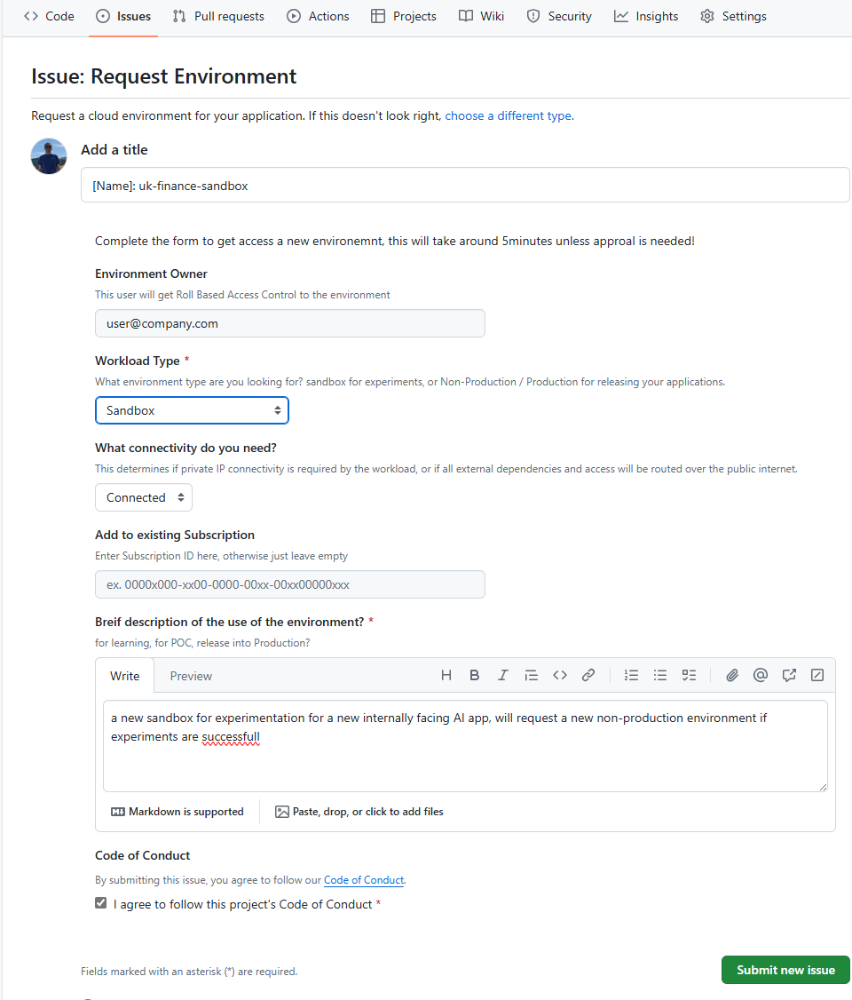
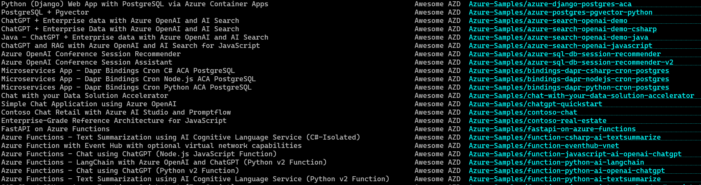

Working with applications teams and partners developing cloud native apps on Azure, you quickly learn developer time is valuable, enthusiasm & flow state is critically important. 

Whenever an application team has to _wait_ for an environment, _wait_ for a access, a service now ticket, a support case, admin access to install tooling, productivity is dramatically effected, projects can be 2x longer and of lower quality.

Equally, it's important to have a designed, governed secure environment when using the public cloud, so your workload teams start right, and stay right! This covers all the normal design pillars of a well architected solution, reliability, security, cost and performance.   

Application teams work best when they can select their preferred platform services, tooling, languages and libraries, and most importantly, reduce their dependencies on external requests & constraints that limit their selection of services. To this end, platform teams number one priority should be to work towards a self-service model, removing themselves from the process, constantly unblock friction points.  


## Where Platform teams should focus


You don't need to have everything automated from day 1, nor have tooling for everything, but focusing in these 5 crucial elements will result in more impact for everyone in your organization, while avoiding unnecessary tickets/cases and bottlenecks, something I have seen depressingly way to often.


### 1. Environment Provisioning 

When an application team works on a new product, timely access to an environment is important when enthusiasm is high. We should be targeting giving access to a fully operational environment within 30 minutes.  This typically means vending a [Resource Group](https://learn.microsoft.com/azure/azure-resource-manager/management/manage-resource-groups-portal#what-is-a-resource-group) with all the access they need to immediately start deploying their solution designs (more on this later).  The resource group naming, tagging, the subscription sharing model and level of access can all be determined base on the environment requested.

The subscription sharing model can be designed to avoid too much subscription sprawl, based on department, or other organisational commonalities, but subscription separation should be enforced on workload type and connectivity (more on this below). You then end up with a subscription list that is meaningful and manageable. There are a number of good resources on [naming recommendations](https://learn.microsoft.com/azure/cloud-adoption-framework/ready/azure-best-practices/resource-naming)

:::tip
Subscriptions in Azure can support hundreds of developers, the subscriptions have granular role-based controls, mature cost tracking services, and you can track [Subscription Limits](https://learn.microsoft.com/azure/azure-resource-manager/management/azure-subscription-service-limits#subscription-limits) & usage very effectively.  We recently had 300 developers across 35 resource groups, deploying resources across the globe,  all working happily in a single sandbox subscription.
:::

During the vending process, it will be important to capture:
 * __Workload Type__ (e.g. Production, Non-production, Sandbox):  This determines the policies that are applied to control what can be deployed & levels of access, also, keeps clear separation between these environments.  Production and Non-Product/Sandbox workload types should be on separate subscriptions, however, a single Sandbox subscription can support may teams resource groups.
 * __Required Networking__ (e.g. Connected or Non-connected):  This determines if private IP connectivity is required by the workload, or if ingress/egress to the workload needs to be privately routed.

The first, simplest, most unconstrained environment you should offer is a Non-connected Sandbox, this allows the application teams the most flexibility to experiment with multiple services, full access to the environment in the portal to allow the team to rapidly get ideas to a POC stage. Here typically, there are no or little restrictions on access or resources that can be provisioned. The most constrained, and complex environment will be a Connected Production subscription, this will have policies to ensure production guardrails are followed, and networking to allow private IP connectivity, and ingress/egress routing controls (if needed).

 A typical application would require the team to request 3 environments, starting with dev, then test (both non-prod and can share a subscription), and a production environment that would be created with a new subscription, each environment progressively getting more restrictive.

:::tip
The new [Subscription Vending Bicep Verified Module](https://github.com/Azure/bicep-registry-modules/tree/main/avm/ptn/lz/sub-vending) is a excellent starting point to start vending these environments, from the simplest to the most complex with a module & parameter driven approach.  You can collect the required information from the application team, then call the vending module directly from the `az cli` to start with, or create a pipeline/action in your favourite  devops tool, maybe trigger a GitHub workflow from a Issue template:


:::


:::tip
__Hot Take #1__:   I'd recommend Bicep over Terraform when automating environment provisioning or application deployment on Azure, even if you are multi-cloud, it's a simple, powerful, performant 1st class experience,  without needing the complexities of a state file, as the state is whatever is deployed in azure, and templates can be re-run and only the changes will be deployed. 
:::


### 2. Environment Permissions

So you have vended an environment, the app team tried to provision their first internally authenticated webapp that calls a gpt-4o model using identity based access, deployed using github actions...  <span style={{color: 'red'}}>error error error</span> 4 tickets in 5 minutes, now the team are googling for workarounds, not delivering their projects, wasting valuable time, and enthusiasm.  What's the problem?

	* No permissions to create a [Role Assignment](https://learn.microsoft.com/azure/role-based-access-control/role-assignments) on the webapp managed identity
	* OpenAI resource not [registered](https://learn.microsoft.com/azure/azure-resource-manager/troubleshooting/error-register-resource-provider?tabs=azure-portal) in subscription
	* Cannot create [Application Registration](https://learn.microsoft.com/entra/identity/role-based-access-control/delegate-app-roles#restrict-who-can-create-applications) in EntraID
	* Require [Admin consent](https://learn.microsoft.com/entra/identity/enterprise-apps/manage-consent-requests#evaluate-a-request-for-tenant-wide-admin-consent) for application permissions.
	* Cannot create [federated access from github](https://learn.microsoft.com/azure/developer/github/connect-from-azure) to deploy to Azure

When building cloud native apps, __managed identity and role based access__ is a crucial part of the application architecture, and 100% the best and most secure way of creating cloud native applications.

Platform teams __must__ provide the appropriate level of access to the application team to allow these solution architectures.  I've seen this being the single thing that wastes tens/hundreds of hours of skilled peoples time

#### Recommendation #1
When assigning roles to the application team on non-production/sandbox workloads, ```Contributor``` is not enough to create identity-based solution architectures! Consider providing the team ```Contributor``` &  ```Role Based Access Control Administrator```, this role can be scoped to the resource group, and can be further [limited](https://learn.microsoft.com/azure/role-based-access-control/role-assignments-portal#step-5-(optional)-add-condition) to only assign selected roles to selected principals.

#### Recommendation #2
Ensure resource provider [registrations](https://learn.microsoft.com/azure/azure-resource-manager/management/resource-providers-and-types#register-resource-provider) have been done as part of the vending process, and not blocking the application teams from creating their resources.

#### Recommendation #3
Many applications will need end-users to authenticate, and the best way of doing that is with Entra ID.  These apps need [application registrations](https://learn.microsoft.com/entra/identity-platform/quickstart-register-app) within EntraID, if your organization blocks the self-service creation of new application registrations, and/or has restrictive consent granting.  Ensure the team know the process for requesting a new application registration.  Also, unless you want a new Service now ticket every time the app team what to add a new callback uri, make then a owner of the app registration in the process.

#### Recommendation #4
Lastly, for Production deployments, look to remove any reliance on any individuals employee identity, and use automated pipelines/workflows that use Service Principals that have been assigned with an appropriate permissions.  See [Use Github Actions to connect to Azure](https://learn.microsoft.com/azure/developer/github/connect-from-azure).


### 3. A little less documentation & a little more sample repos

Environment provisioning provides the application teams a blank slate at this stage, it doesn’t make any assumptions about the application teams solution architecture, this will allow the application team to select the optimal services for their use-cases, that could be a microservices app or a integration workflow, or a simple static webapp.  

Selecting the appropriate service for the use-case will make the best use of the public cloud, optimize your public cloud costs while minimizing the required operations to support your application.  Equally, it's doesn't assume the structure or number of repo's that the application team will use.

However, we should be providing the application teams more support than just a blank canvas, we should be looking to share successful architecture patterns, example applications that have already been approved for use within your organization.

Rather than documents, start to foster a innersource repo of samples, that can be simply provisioned into the vended environment, to show what a static webapp, or a simple microservices app, or an event driven process could look like.  This can provide new teams a starting point with built-in approved patterns to accelerated their journey to production.  These examples, with good READMEs can also inform the teams how to structure there application team repos with the infrastructure-as-code, and automation deployment workflows.  

Look at the [Azure Developer CLI templates](https://learn.microsoft.com/azure/developer/azure-developer-cli/azd-templates) as a good example of this, you don't need to use this tool, but `azd template list` shows a list of sample application patterns with well documented, structured repos. You can start to create a curated list that demonstrates getting started repos in each of the application solution categories for your organisation, even starting with some of these samples where relevant.



#### Infrastructure-as-code modules

Another thing to notice/adopt, in these samples repo ```/infra``` folders, their main bicep file is just composing a number of modules, these modules represent the 'right' way of configuring each service for your organization, for example, pre-configured with private endpoints and RBAC based access and so on.  You can look to build a repo of these modules approved for use in your organization to again, accelerate your application teams. You can also get started by using [Azure Verified Modules](https://azure.github.io/Azure-Verified-Modules/), or build your own [bicep module library](https://learn.microsoft.com/azure/azure-resource-manager/bicep/quickstart-private-module-registry?tabs=azure-cli), using inner-sourcing, sharing this between the application teams.


#### Kubernetes namespace vending

:::note
This article doesn't cover Namespace vending on a large, shared AKS clusters.  I've seen this pattern working very well in organizations with a Kubernetes-first approach to the public cloud, or with a strong will for cloud agnostic solutions, however, this requires additional engineering beyond the scope of this article using AKS + other tooling. There is great session from [2024 Build](https://www.youtube.com/watch?v=mGq442iwAF0) on building this service. 

You can provide example solution patterns & repo's for scale-to-zero microservices using [Azure Container Apps](https://learn.microsoft.com/azure/container-apps/), or for more complex needs, [AKS Automatic](https://learn.microsoft.com/azure/aks/intro-aks-automatic). These are great to add to your library of solution patterns that can be provisioned by your application teams that keep the complexity low, while providing example patterns for the most sophisticated of applications.
:::

### 4. Tooling / Local loop development

Application teams experiment in the portal, develop locally, and provision from their local machine, then, add the automation and the managed identity to perform auto deployments via source control to apply in the later environments.

Ensure the teams can install/configure  VS code /  VS code extensions / command line tools / docker locally, and they have connectivity from these tools to the public cloud APIs they need. 


[```@azure/identity```](https://learn.microsoft.com/en-gb/azure/aks/workload-identity-overview#azure-identity-client-libraries) libraries are now brilliant! For many dependencies, there is no need any more to use API keys or credentials that need to be stored in key-vault's & rotated periodically, now, just use your EntraID's corporate identity or a Managed Identity with RBAC.  Using these identity libraries, If the developer wants to run their code locally, and connect to a database or message service in azure, the locally running app will operate with the local developers corporate identity (obtained through `az login`), and as long as the dev has the appropriate RBAC on the database, all good.  If they deploy their app to Azure PaaS Service, without any code changes, the code will access the database using the services managed identity.  This makes the apps secure and resilient, and can be prompted up to production securely.
  

Without these tools and access, the application teams will not be writing the most secure way of coding their app.


### 5. Track Metrics

Track anything that causes friction.  Anytime the application team is waiting on something, a case, access to a service, resolving a bug, track it, dashboard it, and constantly priorities securely removing friction.  Promote the creation of issues on the platform teams repo, keep a prioritized backlog. Hold monthly feedback sessions.

If Application teams are held up, they will try to work around issues to ship their product, this can mean using the wrong environment, or using a less than ideal service or configuration.  So removing friction will result in better, more secure use of the public cloud.


## Wrapup

Let me know what you think of these recommendations, if you are in a Platform team supporting Azure, I'd love to hear your experiences.  If you are in a Application Team deploying to Azure, have a chat with the team providing you the environment, show them this blog, setup a regular call, its important the teams collaborate to get your companies products out the door, security, reliably and on time. 

